**目录 (Table of Contents)**

[TOCM]

[TOC]


# 多端统一的图标管理方案

> **本文目标：创建一个icons库，且具有一下特性：**

 - 多端统一技术栈：pc, mobile,小程序等使用同一个icon解决方案；
 - 图标目录复用： 多端可复用同一icons库的图标，甚至可以跨项目引用同一icons库；
 - 极简的管理方式：只需在icons目录增删改svg文件，无需额外配置即可在n个项目中直接使用。


> tips:
> 
> node: v20+
>
> 最终代码在 <a href="https://github.com/lycHub/frontend-shared/tree/iconify-base/docs/%E5%A4%9A%E7%AB%AF%E7%BB%9F%E4%B8%80%E7%9A%84%E5%9B%BE%E6%A0%87%E7%AE%A1%E7%90%86%E6%96%B9%E6%A1%88" target="_blank">main</a> 分支，
> 
> 前面基础示例在 <a href="https://github.com/lycHub/frontend-shared/tree/iconify-base" target="_blank">iconify-base</a> 分支

## <a href="https://stackblitz.com/~/github.com/lycHub/frontend-shared" target="_blank">在线Demo</a>

运行main分支代码：

```sh
pnpm i

pnpm dev:icons

pnpm dev:play
```

## 痛点：图标开发管理的混乱

**1. 使用方式非常多**

前端开发中，使用图标的方式非常多，传统的有使用图片、Svg，从字体图标（Icon Fonts）等。基于框架又有很多不同封装，可以自己封装<Icon />组件，也可用第三方库比如svgr。并且每种使用方式也有多种。

比如图片可以用``标签，也可以css url()；

字体图标可以用 unicode `<i class="iconfont">&#x33;</i>` 或 font-class的方式 `<i class="iconfont icon-xxx"></i>`;

svg可以直接使用`<svg />`标签，也可以图片标签加载``, css url也可以加载svg.


**2. 多种图标来源**

- 在线平台比如iconfont, iconify等;
- 设计稿直接下载.

**3. 多项目可复用性**

很多项目都有pc和mobile端，甚至小程序，它们往往都是同一套ui风格，图标也几乎是从同一份设计稿下载的，

但日常开发中同样的图标文件往往只能通过cv的方式粘到各个端的项目中，造成维护成本翻倍，占磁盘空间。

## font-class和svg的局限

尽管上述有那么多使用图标的方式，但实际开发大多是使用svg和font-class的方式， 

因为他们都可以直接通过css来改变尺寸和颜色，这种便利性是其它方案难以做到的，但这两种方式仍有一些局限性。

**在支持用css改图标样式的前提下：**

svg: 不支持小程序。

font-class: 高分辨率下会模糊，不能用js控制内部细节，比如图标的路径动画？

## 确定方案

web: 用svg标签，因为不会失真且能用js控制内部细节，方便做动画；

小程序：为了能用css改图标样式，只能用font-class。

传统的做法是web端项目用svg的封装库，比如svgr，小程序端用iconfont的font-class方案。

今天介绍一个能统一web和小程序技术栈的图标库 —— <a href="https://iconify.design/" target="_blank">Iconify</a>

最后还会演示多端多项目如何引用同一个图标库。


## <a href="https://iconify.design/" target="_blank">Iconify</a> 简介

引用官网原文： Iconify是一套面向开发人员和设计师的工具，旨在以一致的方式轻松使用不同的图标集。

### features
- 官方自带20多万个图标，都经过清理、优化和更新；
- 提供很多优化和操作图标的工具函数，比如图标优化，导入导出等；
- 官方封装了各技术栈对应的图标组件；
- 多场景可用：html, css, svg，figma等...

## 基本使用
> 代码都以react项目为例。

根据不同使用场景选择对应的方式：

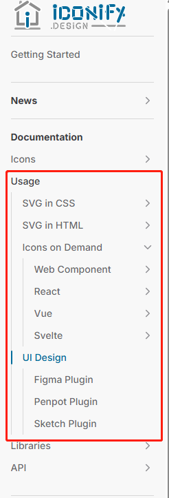

web开发建议使用web component的方式，这样可以不限技术栈。

而web component官方也提供了一个react的封装包[@iconify-icon/react](https://iconify.design/docs/iconify-icon/react.html)，

和[@iconify/react](https://iconify.design/docs/icon-components/react/)不同，前者只是以react的方式封装了一下web component组件，后者完全是react的实现方式。

**安装**
```sh
npm add @iconify-icon/react
```

**找到官方图标**

在[官方图标库](https://icon-sets.iconify.design/)选择一个图标.

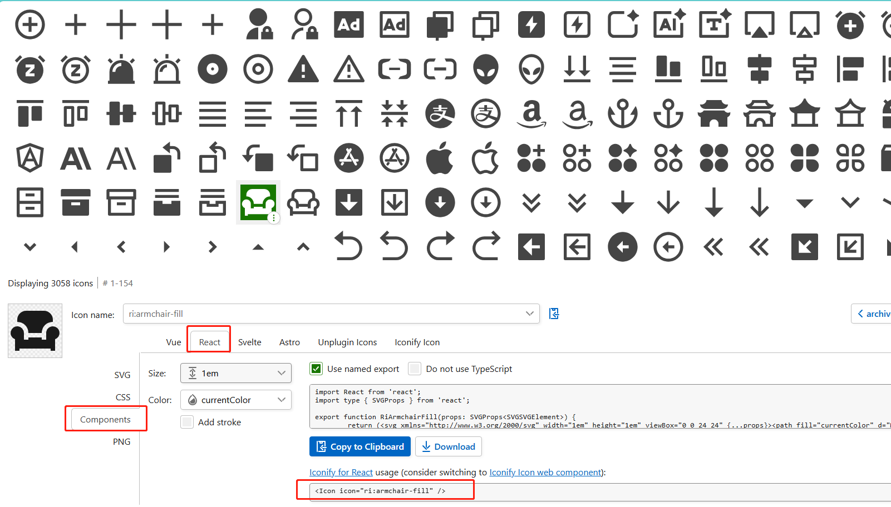


**引入并使用**
```tsx
import { Icon } from "@iconify-icon/react";

function Page() {

  return (
    <div className="page">
      <Icon icon="ri:armchair-fill" />
      <div>
  );
}

```

页面上应该有了一个沙发的图标：

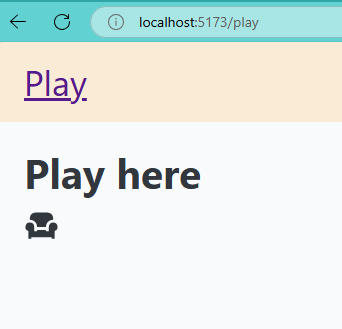

用到那个图标，就是去加载对应的json文件。

**改变属性**

可以方便的用css或自带的一些属性改变图标样式

```tsx
 <Icon icon="ri:armchair-fill" />
      <Icon icon="ri:armchair-fill" style={{ color: '#e00' }} />
      <Icon icon="ri:armchair-fill" style={{ color: '#e00', fontSize: '2em' }} />
      <Icon icon="ri:armchair-fill" style={{ color: '#e00', fontSize: '2em' }} rotate={45} />
```

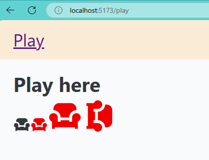

官方图标可很好的满足没有ui设计的公司或项目，怕请求失败的话也可把官方库私有化部署。

## 使用本地图标

对于有设计稿的项目，如果要完美还原，那只能从设计稿下载图标文件。

**添加图标到项目的静态资源目录**

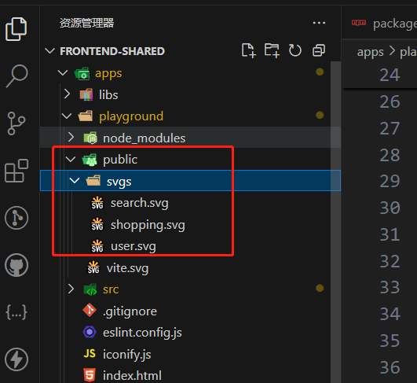

**生成icon data**

```sh
npm add @iconify/tools
```

根目录添加个iconify.js:

```js
import { join, dirname, normalize } from "node:path";
import { fileURLToPath } from "node:url";
import { promises as fs } from "fs";
import {
  importDirectory,
  cleanupSVG,
  runSVGO,
  parseColors,
  isEmptyColor,
} from "@iconify/tools";

export function getDirname() {
  const filename = fileURLToPath(import.meta.url);
  return dirname(filename);
}

const DefaultOptions = {
  sourcePath: "/public/svgs",
  destPath: "/public/zs.json",
};

genIconJson();

function genIconJson(options = {}) {
  const finalOptions = { ...DefaultOptions, ...options };
  refreshIconJson({
    root: getDirname(),
    ...finalOptions,
  }).then(() => {
    console.log(`${finalOptions.destPath} refreshed`);
  });
}

async function refreshIconJson({ root, sourcePath, destPath }) {
  const iconSet = await importDirectory(join(root, sourcePath), {
    prefix: "zs",
    ignoreImportErrors: false,
  });

  iconSet.forEach((name, type) => {
    if (type !== "icon") {
      return;
    }

    const svg = iconSet.toSVG(name);
    if (!svg) {
      iconSet.remove(name);
      return;
    }

    try {
      cleanupSVG(svg);

      parseColors(svg, {
        defaultColor: "currentColor",
        callback: (attr, colorStr, color) => {
          if (!color) {
            return colorStr;
          }

          if (isEmptyColor(color)) {
            return color;
          }
          return "currentColor";
        },
      });

      runSVGO(svg);
    } catch (err) {
      console.error(`Error parsing ${name}:`, err);
      iconSet.remove(name);
      return;
    }

    // Update icon
    iconSet.fromSVG(name, svg);
  });

  // Export as IconifyJSON
  const exported = JSON.stringify(iconSet.export(), null, "\t") + "\n";

  // Save to file
  await fs.writeFile(join(root, destPath), exported, "utf8");
}

```

```sh
node iconify
```

此时会生成一个zs.json, iconify会读取这个文件，里面列出了可以使用的图标。

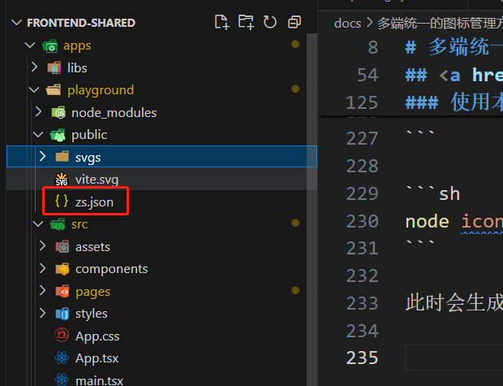


在入口文件处发请求：添加图标到iconify组件

```js
axios.get('/public/zs.json').then(({ data }) => {
  addCollection(data);
});
```

然后就能像用官方组件一样，用自己添加的组件：

```tsx
   <Icon icon="zs:search" style={{ color: "blue" }} />
      <Icon icon="zs:shopping" style={{ color: "red" }} />
      <Icon icon="zs:user" style={{ color: "yellow", fontSize: "24px" }} />
```

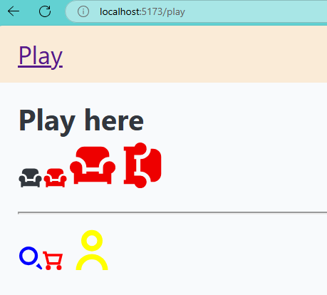


## 写个vite插件优化流程

虽然可以使用本地图标，但每次修改svg目录，还是得跑一下iconify.js, 可用node监听svg目录变化自动run iconify.js.

建议参考项目使用的cli,这里以vite为例写个插件：

vite-plugin-iconify.js
```js
import { join, dirname, normalize } from "node:path";
import { fileURLToPath } from "node:url";
import { promises as fs } from "fs";
import {
  importDirectory,
  cleanupSVG,
  runSVGO,
  parseColors,
  isEmptyColor,
} from "@iconify/tools";

export function getDirname() {
  const filename = fileURLToPath(import.meta.url);
  return dirname(filename);
}

const DefaultOptions = {
  sourcePath: "/public/svgs",
  destPath: "/public/zs.json",
};

export default (options = {}) => {
  const finalOptions = { ...DefaultOptions, ...options };
  let root = getDirname();
  return {
    name: "vite-plugin-iconify",
    apply: "serve",
    configResolved(config) {
      console.log("configResolved>>>", config.root);
      root = config.root;
    },
    configureServer(server) {
      return () => {
        // server.watcher.add(join(root, finalOptions.sourcePath));
        server.watcher.on("add", (path) => {
          // console.log(`File add: ${path} `);
          refreshIconJson({
            root,
            changedFilePath: path,
            ...finalOptions,
          }).then(() => {
            console.log(`${finalOptions.destPath} refreshed`);
          });
        });
        server.watcher.on("unlink", (path) => {
          // console.log(`File unlink: ${path} `);
          refreshIconJson({
            root,
            changedFilePath: path,
            ...finalOptions,
          }).then(() => {
            console.log(`${finalOptions.destPath} refreshed`);
          });
        });
        server.watcher.on("change", (path) => {
          // console.log(`File changed 2: ${path} `);
          refreshIconJson({
            root,
            changedFilePath: path,
            ...finalOptions,
          }).then(() => {
            console.log(`${finalOptions.destPath} refreshed`);
          });
        });
      };
    },
  };
};

async function refreshIconJson({
  root,
  changedFilePath,
  sourcePath,
  destPath,
}) {
  if (!normalize(changedFilePath).includes(normalize(sourcePath))) return;
  const iconSet = await importDirectory(join(root, sourcePath), {
    prefix: "zs",
    ignoreImportErrors: false,
  });

  iconSet.forEach((name, type) => {
    if (type !== "icon") {
      return;
    }

    const svg = iconSet.toSVG(name);
    if (!svg) {
      iconSet.remove(name);
      return;
    }

    try {
      cleanupSVG(svg);

      parseColors(svg, {
        defaultColor: "currentColor",
        callback: (attr, colorStr, color) => {
          if (!color) {
            return colorStr;
          }

          if (isEmptyColor(color)) {
            return color;
          }
          return "currentColor";
        },
      });

      runSVGO(svg);
    } catch (err) {
      console.error(`Error parsing ${name}:`, err);
      iconSet.remove(name);
      return;
    }

    // Update icon
    iconSet.fromSVG(name, svg);
  });

  // Export as IconifyJSON
  const exported = JSON.stringify(iconSet.export(), null, "\t") + "\n";

  // Save to file
  await fs.writeFile(join(root, destPath), exported, "utf8");
}

```


vite.config.js
```js
import { defineConfig } from "vite";
import react from "@vitejs/plugin-react";
import iconify from "./vite-plugin-iconify";

export default defineConfig({
    envDir: "envs",
    cacheDir: "../../node_modules/.vite",
    plugins: [react(), iconify()],
  });
```

配置好后，只需要在svg目录修改图标就能直接用了，比svgr还方便一点，但这点可以忽略不记，

关键是svgr不能用在小程序，这就导致小程序得换其它方案，但iconify支持font-class的用法，能在小程序使用。


## 用于微信小程序

这里以原生微信小程序为例。

首先添加资源目录，放几个svg进去

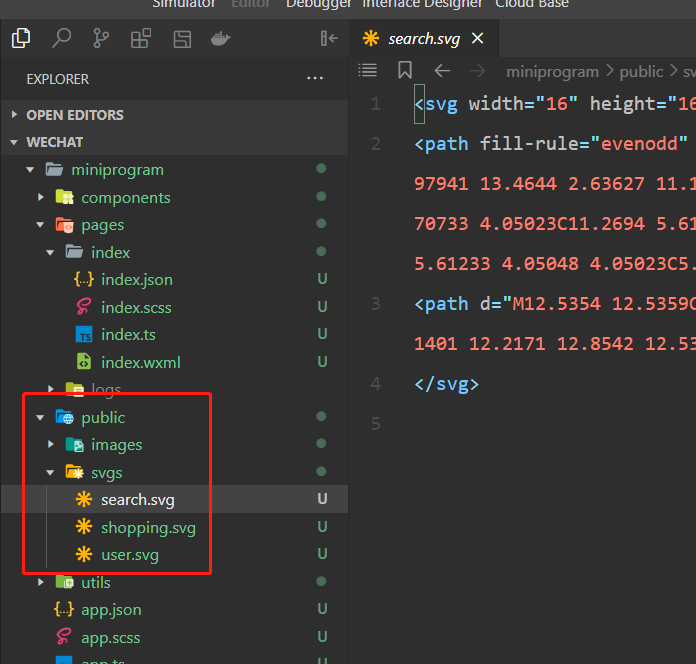

因为是font-class的用法，所以得先给这些图标生成css，和上面类似这里新建一个脚本：

iconify.js
```js
import { writeFileSync } from "node:fs";
import { getIconCSS } from "@iconify/utils";
import {
  importDirectory,
  cleanupSVG,
  runSVGO,
  parseColors,
  isEmptyColor,
} from "@iconify/tools";

const svgPath = "miniprogram/public/svgs";
const destPath = "miniprogram/icon.css";
const ignoreNames = ["logo"];

(async () => {
  const iconSet = await importDirectory(svgPath, {
    prefix: "zs",
    ignoreImportErrors: false,
  });

  let cssStr = "";
  iconSet.forEach((name, type) => {
    if (type !== "icon" || ignoreNames.includes(name)) return;

    const svg = iconSet.toSVG(name);
    if (!svg) {
      // Invalid icon
      iconSet.remove(name);
      return;
    }

    try {
      cleanupSVG(svg);
      parseColors(svg, {
        defaultColor: "currentColor",
        callback: (attr, colorStr, color) => {
          if (!color) {
            return colorStr;
          }

          if (isEmptyColor(color)) {
            return color;
          }
          return "currentColor";
        },
      });

      // Optimise
      runSVGO(svg);
    } catch (err) {
      // Invalid icon
      console.error(`ICON Error parsing ${name}:`, err);
      iconSet.remove(name);
      return;
    }

    const iconData = svg.getIcon();
    cssStr +=
      getIconCSS(iconData, {
        iconSelector: ".zs-icon__" + name,
      }) + "\n";
  });

  writeFileSync(destPath, cssStr, "utf8");
  // todo: watch svgPath by chokidar
})();
```

```sh
node iconify.js
```

然后就会生成icon.css, 导入到全局的app.scss中去

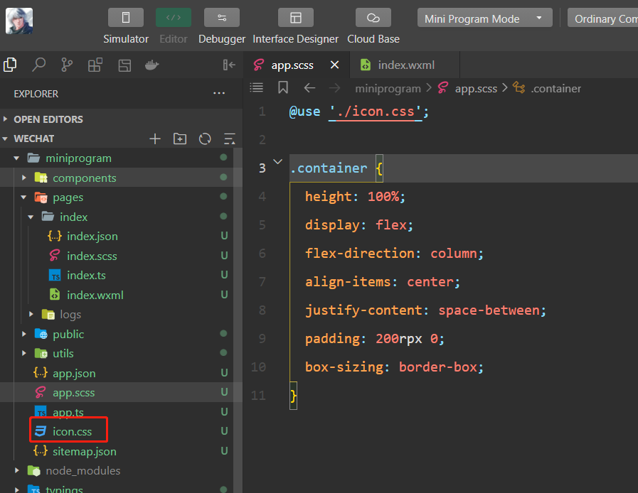

然后在wxml中使用

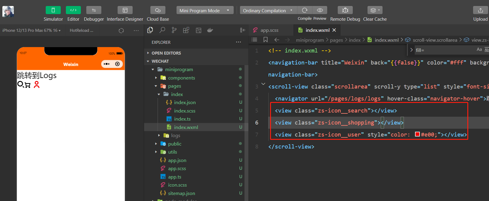

这样web和小程序端都能统一用iconify管理和开发图标，

小程序也能像web端一样监听svg目录变化，自动执行脚本，如果用了taro这种框架，可以写个webpack插件，原生也可以用nodejs监听。

小程序端的监听等会在做，现在还需要解决svg目录复用问题。

## 多端复用svg文件

到目前为止，iconify已经可以同时用于web和小程序，但可以看到，用一个svg目录，却要复制两份分别放到web端和小程序端的静态目录里，这还只是两个项目，如果这仓库有多个子项目，svg目录体积将成倍增长，而且跨项目也无法复用。

下面开始改造目录结构，让多项目可从统一图标库复用图标，**当前基础示例的代码暂存在 `iconify-base` 分支**

### 思路

利用monorepo的方式，单独创建一个图标库，暴露出web和小程序端使用到的iconData.json和icon.css, 并写一个node监听脚本，达到自动化。

#### 创建图标库项目

在库中先node build生成icon-data.json和icon.css，然后导出：

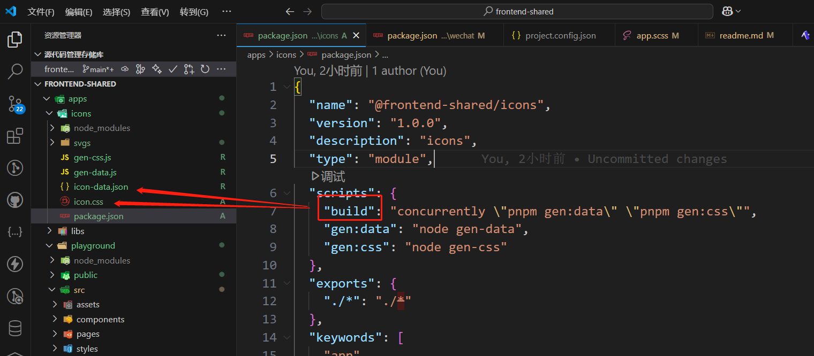

#### 复用build出来的文件(json、css)

  1. 部署到远程(推荐)：这样只要远程跟新了，其它项目通过http请求就能直接更新；
  2. 本地通过monorepo的方式引用：不能垮项目；
  3. 把icons项目发布到npm: 更新麻烦。

下面演示第2种方式。

在web端引用：

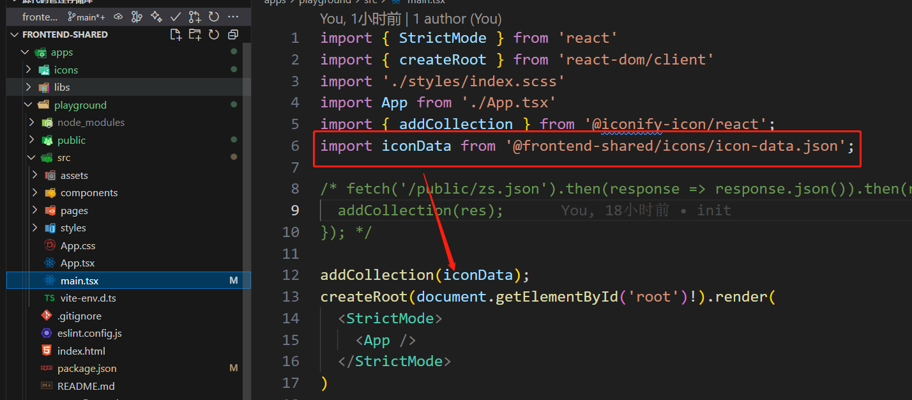

如果远程部署了仍然可以通过http请求。

在小程序引用：

如果用了taro之类的，引用方式类似web端，

但原生小程序小程序 `app.scss` 没法直接从monorepo中引入css,

这里需要一个额外的脚本: 

在wechat项目根目录新建copy.js:

```js
import { copyFile } from "node:fs/promises";

try {
  await copyFile("../icons/icon.css", "./miniprogram/icon.css");
  console.log("copy icon.css success");
} catch (error) {
  console.error("The icon.css could not be copied", error);
}

```

```sh
node copy
```

这样就将icon.css复制到小程序里了，然后引入并使用：

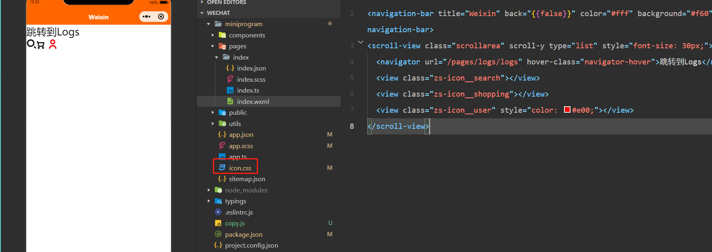


## 小结

现在web端和小程序端，甚至更多的端比如管理系统，或其他子项目，

都可以从同一个icons库复用图标

1. 统一了多端技术栈 —— iconify.js；
2. 多项目复用同一个图标库；
3. 把icon一次下载好后，运行一次脚本，所有web和taro等项目即可使用，原生小程序得多跑一次脚本。

## 更进一步

流程上还有些可优化的点：

1. 监听icons/svgs目录，每次svgs变化自动刷新json和css（如果需要频繁的更新icons里的svg文件）;
2. 原生小程序视情况也可以改成监听脚本；
3. 随着图标越来越多，json和css也会越来越大，能否按需加载？
  


第二条做法同第一条。

第三条只需把icon-data.json中的icons字段拆开就行。


### 下面只实现第一条

**添加一个watch.js和script:**

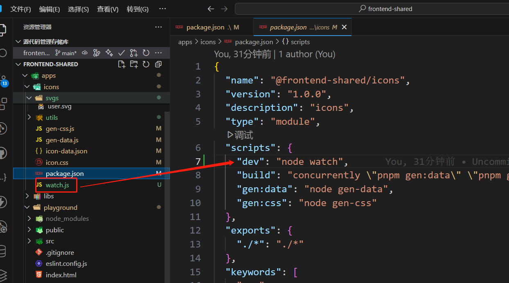

```sh
  // 监听svgs变化，自动刷新icon.css和icon-data.json
  npm run dev
```


所以如果项目需要频繁变动svg文件，
只需多跑一个 `npm run dev` 即可。

## 运行最终代码

运行main分支代码：

```sh
pnpm i

pnpm dev:icons

pnpm dev:play
```

实际项目可视情况用 `concurrently` 合并 pnpm dev:icons 和 pnpm dev:play

```sh
"concurrently \"pnpm dev:icons\" \"pnpm dev:play\"",
```