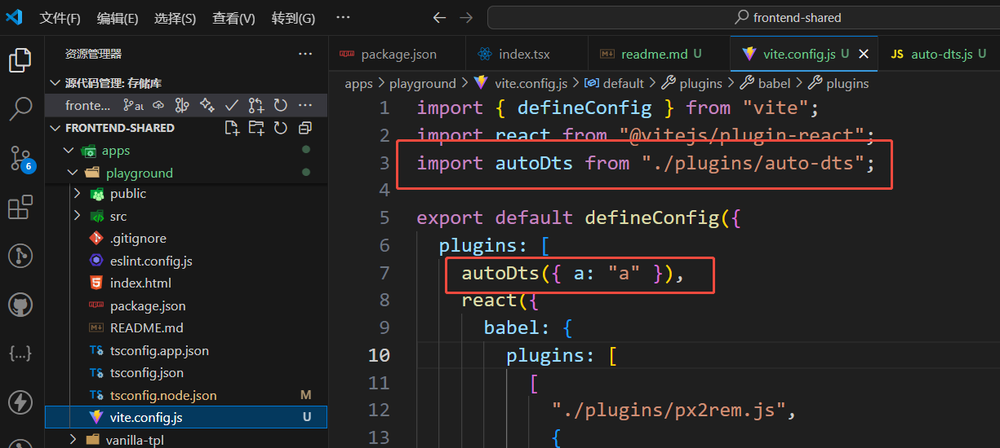
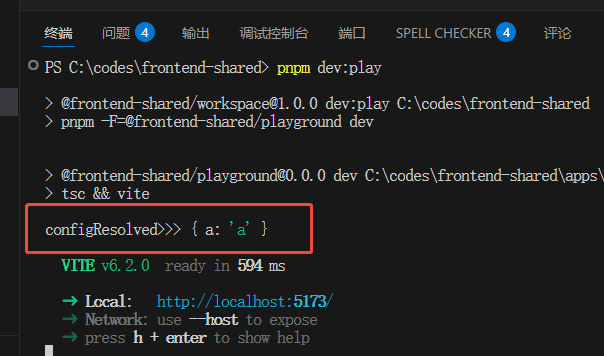
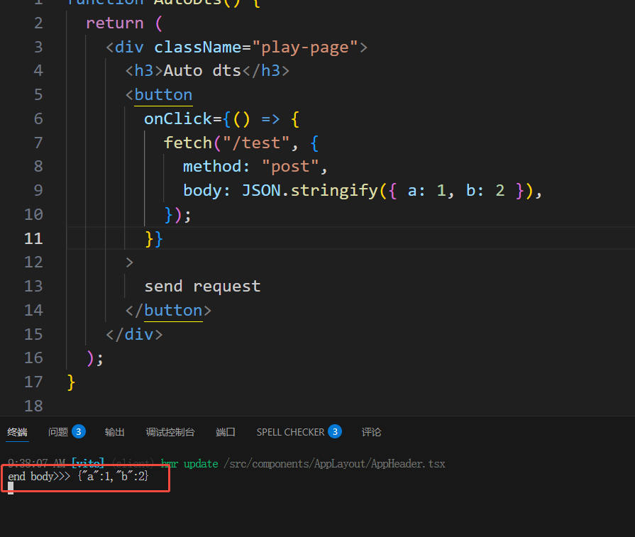
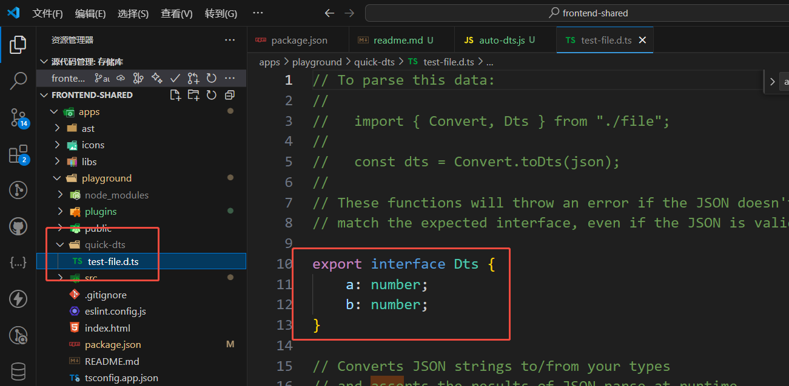
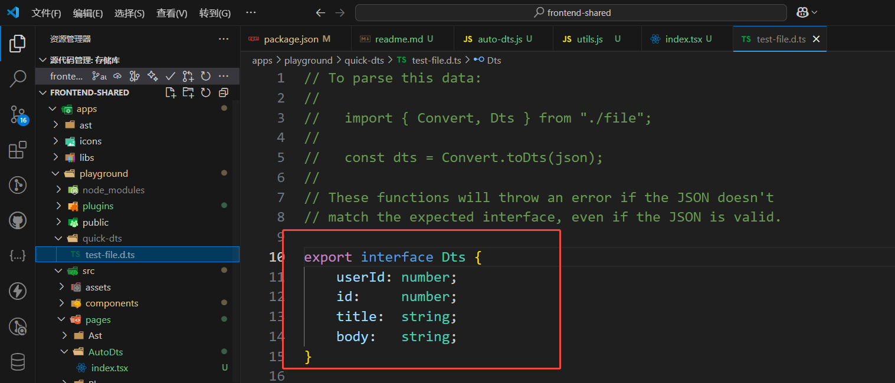

**目录 (Table of Contents)**

[TOCM]

[TOC]

# 根据接口数据自动生成 typescript declaration file

> **本文简介：**

编写一个 vite 插件，使其在 dev server 时能自动根据接口 response json 生成 dts 文件，涉及到的知识点：

- 编写 vite 插件；
- fs-extra, node.fs 的增强库；
- [quicktype](https://github.com/glideapps/quicktype)，json 转 dts 的核心库。

> tips:
>
> node: v20+
>
> 最终代码在 [main 分支](https://github.com/lycHub/frontend-shared/blob/main/docs/%E9%81%8D%E5%8E%86ast/1-%E5%86%99babel%E6%8F%92%E4%BB%B6%E7%BC%96%E8%AF%91%E5%92%8C%E4%BC%98%E5%8C%96%E4%BB%A3%E7%A0%81.md)

## [在线 Demo](https://stackblitz.com/~/github.com/lycHub/frontend-shared?file=docs/%E9%81%8D%E5%8E%86ast/1-%E5%86%99babel%E6%8F%92%E4%BB%B6%E7%BC%96%E8%AF%91%E5%92%8C%E4%BC%98%E5%8C%96%E4%BB%A3%E7%A0%81.md)

运行 playground demo：

```sh
pnpm i

pnpm dev:play

```

## 平常给 json 写 dts 的方法大概有：

- 手写
- 在线网站
- json2dts vscode 插件

以上至少都需要一个 copy json 到某个地方的步骤，下面用[quicktype](https://github.com/glideapps/quicktype)进一步简化该流程。

## 思路

给 dev server 写个接口，把数据作为 post 参数传进去，把生成的内容写进 dts 文件即可。

## 开始

### 新建一个[vite 插件](https://cn.vite.dev/guide/api-plugin.html)

新建 plugins/auto-dts.js 并写些模板代码

```js
export default (options) => {
  return {
    name: "vite-plugin-auto-dts",
    apply: "serve",
    configResolved() {
      console.log("configResolved>>>", options);
    },
  };
};
```

在 vite.config.js 中使用：



run "pnpm dev:play", 控制台能看到 log：



### 利用 vite server 写一个接口

configureServer 钩子可给 vite server 写中间件

```js
export default (options) => {
  return {
    name: "vite-plugin-auto-dts",
    apply: "serve",
    configResolved() {
      console.log("configResolved>>>", options);
    },
    configureServer(server) {
      return () => {
        server.middlewares.use((req, res, next) => {
          if (req.method.toLowerCase() === "post" && req.url === "/test") {
            res.setHeader("Content-Type", "application/json;charset=utf-8");
            let body = "";
            req.on("data", (chunk) => {
              body += chunk.toString();
            });

            req.on("end", () => {
              console.log("end body>>>", body);
              res.statusCode = 201;
              res.end(body);
              next();
            });
          } else {
            next();
          }
        });
      };
    },
  };
};
```

上面写一个 /test 的 post 请求，并打印传进来的 body，

然后在页面尝试请求：

```js
fetch("/test", {
  method: "post",
  body: JSON.stringify({ a: 1, b: 2 }),
});
```

控制台会打印出 body 参数：



### 校验参数

我们需要确保参数能被 json.parse 处理。

```js
export function isJson(str) {
  if (typeof str == "string") {
    try {
      JSON.parse(str);
      return true;
    } catch (e) {
      console.log("Json parse error：" + str + "!!!" + e);
      return false;
    }
  }
  return false;
}

export function isObj(obj) {
  return Object.prototype.toString.call(obj) === "[object Object]";
}

export function validBodyString(data) {
  let errMsg = "";
  if (!isJson(data)) {
    errMsg = "data must be an json string";
  }
  const jsonData = JSON.parse(data);
  if (!isObj(jsonData)) {
    errMsg = "data must be an object";
  }

  return errMsg;
}

// ...

req.on("end", () => {
  console.log("end body>>>", body);
  const errMsg = validBodyString(body);
  if (errMsg) {
    res.statusCode = 400;
    res.end(errMsg);
  } else {
    res.statusCode = 201;
    res.end("Auto gen dts success");
  }
  next();
});

//...
```

### 设定默认参数和 root path

root path 正常情况是用户项目根目录，但如果要作为 npm 包发布，

由于最终代码在 node_modules 中，所以需要确保生成的文件路径是基于用户根目录的。

首先设定默认 options：

```js
const DefaultOptions = {
  // dts文件生成目录
  outputDir: "/quick-dts",

  // 已有同名文件是否覆盖
  cover: false,

  // 前端接口路径
  routePath: "/gen-dts",
};
```

auto-dts.js:

```js
// ...

export default (options = {}) => {
  const finalOptions = { ...DefaultOptions, ...options };
  let root = getDirname();
  return {
    name: "vite-plugin-res-to-dts",
    apply: "serve",
    configResolved(config) {
      // 这样就能确定root指向用户根目录
      console.log("configResolved>>>", config.root);
      root = config.root;
    },
  };
};

//...
```

### 检查是否已有同名的 dts 文件

```js
//...

// 为简化这里写死，实际需要用户自己传过来
const fileKey = "test-file";
const destPath = join(root, finalOptions.outputDir, `${fileKey}.d.ts`);

if (!finalOptions.cover) {
  const isExit = await pathExists(destPath);
  if (isExit) {
    end();
    next();
    return;
  }
}

//...
```

### 根据 body 参数生成 dts 文件

```js
// ...

try {
  const result = await genType(body);
  // console.log("quicktype res>>>", result);
  if (result) {
    await outputFile(destPath, result, {
      flag: "a",
    });
    res.statusCode = 201;
    res.end("Auto gen dts success");
  } else {
    res.statusCode = 400;
    res.end("Auto gen dts fail");
  }
} catch (error) {
  res.statusCode = 400;
  res.end(error.message);
} finally {
  next();
}

// ...
async function genType(data) {
  const jsonInput = jsonInputForTargetLanguage("TypeScript");
  await jsonInput.addSource({
    name: "dts",
    samples: [data],
  });

  const inputData = new InputData();
  inputData.addInput(jsonInput);

  const { lines } = await quicktype({
    inputData,
    lang: "TypeScript",
  });
  if (lines?.length) {
    let str = "";

    for (const line of lines) {
      str += `${line}\r\n`;
    }
    return str;
  }

  return "";
}
```

然后重启服务并调接口，会在项目根目录生成 /quick-dts/test-file.d.ts：



### 基本实现结束，换个真实接口测试

```js
const onClick = () => {
  fetch("https://jsonplaceholder.typicode.com/posts")
    .then((res) => res.json())
    .then((res) => {
      fetch("/gen-dts", {
        method: "POST",
        body: JSON.stringify(res),
      });
    });
};
```


