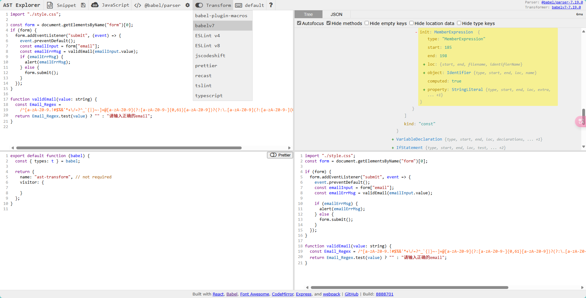

**目录 (Table of Contents)**

[TOCM]

[TOC]

# AST 语法树之 babel 插件

> **本文简介：**

1. 编写一个代码优化插件(up-regexp.js)：

- 熟悉 babel 的基本使用；
- 了解在线编写 babel 插件的基本方法；
- 介绍 babel 遍历 ast 的相关文档；
- 将在线写好的插件用于本地代码中。

2. 编写一个能用于 tsx 的 px2rem.js：

- 在线编写 px2rem 的 babel 插件；
- 在 vite+tsx 的 demo 中使用。

> tips:
>
> node: v20+
>
> 最终代码在 [main 分支](https://github.com/lycHub/frontend-shared/blob/main/docs/%E9%81%8D%E5%8E%86ast/1-%E5%86%99babel%E6%8F%92%E4%BB%B6%E7%BC%96%E8%AF%91%E5%92%8C%E4%BC%98%E5%8C%96%E4%BB%A3%E7%A0%81.md)

## [在线 Demo](https://stackblitz.com/~/github.com/lycHub/frontend-shared?file=docs/%E9%81%8D%E5%8E%86ast/1-%E5%86%99babel%E6%8F%92%E4%BB%B6%E7%BC%96%E8%AF%91%E5%92%8C%E4%BC%98%E5%8C%96%E4%BB%A3%E7%A0%81.md)

运行 ast demo：

```sh
pnpm i

pnpm build:ast

```

运行 playground demo：

```sh
pnpm i

pnpm dev:play

```

## 插件 up-regexp.js 功能介绍

假设项目中出现以下代码：

```ts
function validEmail(value: string) {
  const Email_Regex =
    /^[a-zA-Z0-9.!#$%&'*+\/=?^_`{|}~-]+@[a-zA-Z0-9](?:[a-zA-Z0-9-]{0,61}[a-zA-Z0-9])?(?:\.[a-zA-Z0-9](?:[a-zA-Z0-9-]{0,61}[a-zA-Z0-9])?)*$/;

  return Email_Regex.test(value) ? "" : "请输入正确的email";
}

validEmail();
```

email 正则是固定的，不应该写在方法里，不然每次 validEmail() 都会声明一个同样的正则。

此时可通过编写 babel 插件优化项目中的类似代码，

把函数内的 Email_Regex 提到文件最外层，并且换一个不会冲突的变量名(\_Email_Regex)，把用到 Email_Regex 的地方换成\_Email_Regex，

优化后的代码大概像这样：

```ts
const _Email_Regex =
  /^[a-zA-Z0-9.!#$%&'*+\/=?^_`{|}~-]+@[a-zA-Z0-9](?:[a-zA-Z0-9-]{0,61}[a-zA-Z0-9])?(?:\.[a-zA-Z0-9](?:[a-zA-Z0-9-]{0,61}[a-zA-Z0-9])?)*$/;

function validEmail(value: string) {
  return _Email_Regex.test(value) ? "" : "请输入正确的email";
}

validEmail();
```

## 编写 babel 插件的准备工作

- [在线 ast](https://astexplorer.net/)

  这是各种 ast 库的 playground，

  当然每个具体的 ast 库也可能有自己专门的 playground，比如 typescript;

- [插件文档](https://github.com/jamiebuilds/babel-handbook/blob/master/translations/zh-Hans/plugin-handbook.md#toc-introduction)

  操作 ast 树相关方法的文档

- [babel-types](https://www.babeljs.cn/docs/babel-types)

  这是判断和操作各种语句、节点的工具库。

## 在线 ast 的使用

### 打开https://astexplorer.net/，默认界面如下：


### 准备一段示例代码黏贴进去：

```ts
import "./style.css";

const form = document.getElementsByName("form")[0];
if (form) {
  form.addEventListener("submit", (event) => {
    event.preventDefault();
    const emailInput = form["email"];
    const emailErrMsg = validEmail(emailInput.value);
    if (emailErrMsg) {
      alert(emailErrMsg);
    } else {
      form.submit();
    }
  });
}

function validEmail(value: string) {
  const Email_Regex =
    /^[a-zA-Z0-9.!#$%&'*+\/=?^_`{|}~-]+@[a-zA-Z0-9](?:[a-zA-Z0-9-]{0,61}[a-zA-Z0-9])?(?:\.[a-zA-Z0-9](?:[a-zA-Z0-9-]{0,61}[a-zA-Z0-9])?)*$/;
  return Email_Regex.test(value) ? "" : "请输入正确的email";
}
```

此时右边应该会报错：


因为刚才贴的是 ts 代码，而默认配置只识别 js 代码。

首先选择和配置编译库，babel 用的是 babel-parser:


这样就能正确将 ts 代码转成语法树(ast):


### 开启 babel 插件模式

打开 transform 并选择 babel v7:



左下角就是 babel 插件的基本格式。

## 开始编写 up-regexp.js

babel parser 会对右边的 ast 深度遍历，

这里只需要关心所有的 regexp 字面量即可，

将用鼠标点击正则表达式的值，右边就会自动定位到对应的节点类型：


此时可在左下角的 visitor 对象中，实现 RegExpLiteral 方法并打印 path.node：


确定选到了目标节点。

### scope 的概念

[参考](https://github.com/jamiebuilds/babel-handbook/blob/master/translations/zh-Hans/plugin-handbook.md#toc-scopes)

### 步骤一：基于旧的变量名生成一个新的 uid 变量名

打印 path.parent.id 能拿到旧的变量名(Email_Regex)


基于旧名字生成一个唯一的新变量名

```js
const oldName = path.parent.id.name;
const newIdentifier = path.scope.generateUidIdentifierBasedOnNode(
  path.parent.id
).name;
console.log("RegExpLiteral>>>", newIdentifier); // _Email_Regex
```

generateUidIdentifierBasedOnNode 方法能保证生成的变量名不会和当前文件其它变量名冲突。

### 步骤二：把函数内用到旧名称的地方全都替换成新名称

```js
/* 
  这会将函数内Email_Regex替换成_Email_Regex，
path.scope指当前正则所处的函数内部
*/

path.scope.rename(oldName, newIdentifier);
```


### 步骤三：把函数内的正则声明删掉

```js
/**
 * path.parentPath值正则值所处的整条声明语句，也就是
 * const Email_Regex = xxx;
 */
path.parentPath.remove();
```


### 步骤四：用新的变量名构造一条正则声明

```js
const newDeclaration = t.variableDeclaration("const", [
  t.variableDeclarator(
    t.identifier(newIdentifier),
    t.regExpLiteral(path.parent.init.pattern)
  ),
]);

// 相当于新生成了 const _Email_Regex = xxx;
console.log("newDeclaration >>>", newDeclaration);
```

**这里解释下 babel types 文档如何查看**

t.variableDeclaration 文档如下：


declarations 参数是一个 VariableDeclarator[], 再看 VariableDeclarator 的文档：


VariableDeclarator 接收 id 和 init, id 是 LVal 类型，init 是个 Expression。

LVal 类型有以下几种：


而 "const" 属于 Identifier, 所以 VariableDeclarator 的第一个参数就是 t.identifier(newIdentifier)；

Expression 类型 参考：https://www.babeljs.cn/docs/babel-types#expression


正则表达式属于 regExpLiteral：


所以 VariableDeclarator 的第二个参数就是 t.regExpLiteral(path.parent.init.pattern)；

### 步骤五：把 newDeclaration 推到当前文件最外层，顶部

```js
const program = path.findParent(t.isProgram);
program.node.body.unshift(newDeclaration);
```

这就是提升正则最基本的实现：


再加个复杂点的场景试下：

```js
function validNumber(value: string) {
  const run = () => {
    const Number_Regex = /^\d+$/;
    console.log(Number_Regex);
    return Number_Regex;
  };
  return run().test(value) ? "" : "请输入数字";
}
```


这样在线的 up-regexp.js 就写好了。

## 将在线的 up-regexp.js 用于本地项目

新建了 ast 目录并将源码复制到 main.ts


下面安装 babel，用它把 main.ts 编译成 main.js

```sh
npm add @babel/cli @babel/core @babel/preset-env @babel/preset-typescript -D
```

- @babel/cli: 编译文件用的命令行；
- @babel/core: 编译文件的核心包；
- @babel/preset-env: 编译 js 要用的常规预设(预设就是若干插件的集合，可避免一个个装一堆插件)；
- @babel/preset-typescript：编译 ts 需要的预设。

新建 babel.config.json:

```json
{
  "presets": [
    [
      "@babel/preset-env",
      {
        "targets": {
          "edge": "17",
          "firefox": "60",
          "chrome": "67",
          "safari": "11.1"
        },
        "useBuiltIns": "usage",
        "corejs": "3.6.5"
      }
    ],
    ["@babel/preset-typescript"]
  ]
}
```

presets 是从后往前执行的，所以"@babel/preset-typescript"放最后。

增加一个 script:

```json
{
  "build": "babel ./src/main.ts --out-file dist/main.js"
}
```

此时 npm run build 应该能把 main.ts 转成 main.js

> 如果跑 demo 代码请在根目录下 pnpm build:ast 代替


> 编译后的 js 语法版本取决于 tsconfig.json 中的 target, demo 是 es2020.

此时还只是 ts => js，正则也是原样输出，现在把在线的 up-regexp.js 复制过来，并修改 babel.config.json:


up-regexp.js 的内容和在线的一样，不用修改。

然后再 run build 一下，效果和在线的一样：


到此 up-regexp.js 就完成了。

## 插件 px2rem.js

目前只有用于 css 文件的 px2rem, 但 js, html 中想要实现也是可以的，

虽然使用场景不多，但可作为练习 ast 的例子，写完后把它用于一个 vite + tsx 的项目中。

和之前方法一样，我这直接给出最终的代码：

```js
const normalPxReg = /(\d+(\.\d+)?)px/g;
const blendPxReg = /(\w+)px/g;
let options = { remUnit: 16, remPrecision: 8 };
const varMap = new Map();
export default ({ types }, opts, rootPath) => {
  // console.log('rootPath>>>', rootPath); 根目录
  Object.assign(options, opts);
  return {
    visitor: {
      VariableDeclarator(path) {
        const { id, init } = path.node;
        const validValue =
          init && init.value && !isNaN(+init.value)
            ? init.value.toString()
            : null;
        if (validValue) {
          varMap.set(id.name, validValue);
        }
      },
      StringLiteral(path) {
        const { value } = path.node;
        if (normalPxReg.test(value)) {
          const strNode = types.stringLiteral(calcValue(value));
          path.replaceWith(strNode);
        }
      },
      TemplateLiteral(path) {
        // const tplContent = `${path.node.quasis[0].value.raw}${path.node.expressions[0].name}${path.node.quasis[1].value.raw}`
        let tplContent = "";
        path.node.quasis.forEach((qua, index) => {
          const targetExpression = path.node.expressions[index];
          tplContent +=
            qua.value.raw + (targetExpression ? targetExpression.name : "");
        });
        // console.log('tplContent>>>', tplContent);
        const newTplContent = tplContent.replace(blendPxReg, (matchStr, g1) => {
          // console.log('matchStr', matchStr, g1, +g1);
          if (g1) {
            if (isNaN(+g1)) {
              const value = varMap.get(g1);
              // console.log('value>>>', value);
              if (value || value === 0) {
                return calcValue(value + "px");
              }
            } else {
              return calcValue(matchStr);
            }
          }
          return matchStr;
        });
        // console.log('newTplContent>>>', newTplContent);
        const strNode = types.stringLiteral(newTplContent);
        path.replaceWith(strNode);
      },
    },
  };
};

function calcValue(value) {
  const { remUnit, remPrecision } = options;
  return value.replace(normalPxReg, (_, $1) => {
    let val = (+$1 / remUnit).toFixed(remPrecision);
    return val + "rem";
  });
}
```

可以看到源码中的 px 都转成了 rem:


下面用于 vite+tsx 的 demo 中， 根目录下运行： pnpm dev:play, 打开浏览器,

默认情况如下：


box 源码如下：


由于最新的 vite 已经不用 babel 了，所以默认不会读取 babel.config.json,

但 playground 这个 demo 用了"@vitejs/plugin-react", 这个插件能配置 babel:

vite.congig.ts:

```ts
import { defineConfig } from "vite";
import react from "@vitejs/plugin-react";

export default defineConfig({
  plugins: [
    react({
      babel: {
        plugins: [
          [
            "./plugins/px2rem.js",
            {
              remUnit: 75,
              remPrecision: 5,
            },
          ],
        ],
      },
    }),
  ],
});
```

然后新建 /plugins/px2rem.js 把刚才的代码复制过来，
重新 pnpm dev:playground, 效果如下：


## 关于是否应该写 babel 插件

上面两个例子都改写了源码的输出，这很容易导致源码和浏览器运行时效果不一致，如 tsx 里的 px2rem,

不熟悉代码的人一时之间根本找不到 px => rem 的源头在哪，而且这个需求在 js/ts 中远没有 css 那么重要，

如果真正有这个需求，建议还是封装一个 px2rem 的工具方法更好。
