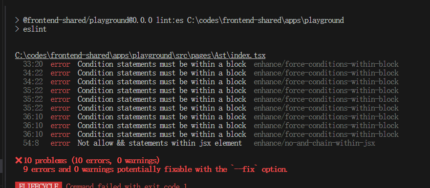

**目录 (Table of Contents)**

[TOCM]

[TOC]

# 手写 eslint plugin

> **本文简介：**

编写两个 eslint 规则，掌握 eslint plugin 开发方式：

- 'force-conditions-within-block': 要求 if...else...要有 block({})包裹；

```js
// valid

if (Math.random() > 0.5) {
  console.log("large");
} else if (y > 20) {
  console.log("yy");
} else {
  console.log("small");
}

// invalid
if (num > 0.4) console.log("large");
else if (x > 20) console.log("aaa");
else if (x < 20) console.log("bb");
else console.log("small");
```

- 'no-and-chain-within-jsx': jsx 中禁止短链语句 `{ auth?.user && <button>submit</button> }`

```tsx
<div className="ast-page">
  <h3>Ast here</h3>

  {/* invalid */}
  {data && (
    <div className="info">
      <p>title: {data.title}</p>
      <p>body: {data.body}</p>
    </div>
  )}

  <div>
    {/* valid */}
    {data ? (
      <div className="info">
        <p>title: {data.title}</p>
        <p>body: {data.body}</p>
      </div>
    ) : null}
  </div>
</div>
```

写好的规则在命令行和 vscode 中都会有报错提示和自动修复：


> tips:
>
> node: v20+
>
> 最终代码在 [main 分支](https://github.com/lycHub/frontend-shared/blob/main/docs/%E5%B0%86json%E6%95%B0%E6%8D%AE%E8%87%AA%E5%8A%A8%E7%94%9F%E6%88%90dts%E6%96%87%E4%BB%B6/readme.md)

## [在线 Demo](https://stackblitz.com/~/github.com/lycHub/frontend-shared?file=docs/%E5%B0%86json%E6%95%B0%E6%8D%AE%E8%87%AA%E5%8A%A8%E7%94%9F%E6%88%90dts%E6%96%87%E4%BB%B6/readme.md)

运行 playground demo：

```sh
pnpm i

pnpm -C=apps/playground lint:es

```

## 用途

用于第三方插件未能覆盖到的场景

## 开始

### 新建一个 eslint plugin 并写些模板代码

plugins/enhance.js

```js
export default {
  meta: {
    /* 插件名，建议设置 */
    name: "eslint-plugin-enhance",
    /* 版本，建议设置 */
    version: "0.0.1",
    docs: {
      // 描述
      description: "Enhance eslint rules.",
    },
  },
  rules: {
    "force-conditions-within-block": {
      meta: {
        // layout 表示这条规则只涉及外观，比如空格、括号等
        type: "layout",
        docs: {
          // 规则描述
          description: "Condition statements must be within a block.",
        },

        // 是否能让 --fix 修复
        fixable: "code",
        messages: {
          // 错误信息之一
          notWithinBlock: "Condition statements must be within a block.",
        },
      },

      // 规则主体，遍历 ast 、报错 、修复的地方
      create(context) {
        return {};
      },
    },
  },
};
```

### 准备代码

```ts
// valid
if (Math.random() > 0.5) {
  console.log("large");
} else {
  console.log("small");
}

// invalid
if (Math.random() > 0.5) console.log("large");
else console.log("small");
```

> tip: 源码位置 apps\playground\src\pages\Ast\index.tsx

### 设置[astexplorer](https://astexplorer.net/)


astexplorer 相关说明可参考 [babel 分享](https://github.com/lycHub/frontend-shared/blob/main/docs/%E9%81%8D%E5%8E%86ast/1-%E5%86%99babel%E6%8F%92%E4%BB%B6%E7%BC%96%E8%AF%91%E5%92%8C%E4%BC%98%E5%8C%96%E4%BB%A3%E7%A0%81.md)

### 观察两段代码的差异


可以初步判断，consequent 和 alternate 的类型不等于"BlockStatement", 就算 invalid

### 编写主体代码(create 函数)

```js
// ...
  create(context) {
        return {
          // 遍历if语句
          IfStatement(node) {
            // get if分支的node
            const consequentNode = node.consequent;
            if (consequentNode.type !== "BlockStatement") {
              // 报告错误
              context.report({
                // 出错的node(代码)
                node: consequentNode,
                // 错误消息的id
                messageId: "notWithinBlock",
              });
            }
          },
        };
      },

// ...
```

### 使用插件

eslint.config.js:

```js
// ...
{
    files: ["src/**/*.{ts,tsx}"],
    plugins: {
      // 插件名作用域，对应rules中的enhance/xxx
      enhance,
    },
    rules: {
      // 这个 enhance 对应plugins中的key
      "enhance/force-conditions-within-block": "error",
    },
  },
  // ...
```

### run eslint

```sh
pnpm -C=apps/playground lint:es
```


规则已生效

### 编写修复代码

```js
// ...
context.report({
  node: consequentNode,
  messageId: "notWithinBlock",
  fix(fixer) {
    // 给 consequentNode 两边加block
    return [
      fixer.insertTextBefore(consequentNode, "{"),
      fixer.insertTextAfter(consequentNode, "}"),
    ];
  },
});
// ...
```

### 再次运行并加上 --fix

```sh
pnpm -C=apps/playground lint:es --fix
```


控制台已不再报错，代码也自动加上了 block


### 同理将 else 修复并测试

```js

 create(context) {
        return {
          IfStatement(node) {
            const consequentNode = node.consequent;
            if (consequentNode.type !== "BlockStatement") {
              context.report({
                node: consequentNode,
                messageId: "notWithinBlock",
                fix(fixer) {
                  return [
                    fixer.insertTextBefore(consequentNode, "{"),
                    fixer.insertTextAfter(consequentNode, "}"),
                  ];
                },
              });
            }

            const alternateNode = node.alternate;
            if (!alternateNode?.type) return;
            if (alternateNode.type !== "BlockStatement") {
              context.report({
                node: alternateNode,
                messageId: "notWithinBlock",
                fix(fixer) {
                  return [
                    fixer.insertTextBefore(alternateNode, "{"),
                    fixer.insertTextAfter(alternateNode, "}"),
                  ];
                },
              });
            }
          },
        };
      },

```

```sh
pnpm -C=apps/playground lint:es --fix
```

if 和 else 分支都已经加上 block


### 处理 else if

多个 else if 可用递归来处理，以下简单示例：

```js

// ...
 create(context) {
        return {
          IfStatement(node) {
            loopIfStatement(node, context);
          },
        };
      },


function loopIfStatement(rootNode, context) {
  const loop = (node) => {
    const consequentNode = node.consequent;
    // console.log("IfStatement consequentNode>>>", consequentNode);
    if (consequentNode.type !== "BlockStatement") {
      context.report({
        node: consequentNode,
        messageId: "notWithinBlock",
        fix(fixer) {
          return [
            fixer.insertTextBefore(consequentNode, "{"),
            fixer.insertTextAfter(consequentNode, "}"),
          ];
        },
      });
    }

    const alternateNode = node.alternate;
    if (!alternateNode?.type) return;
    if (alternateNode.type === "IfStatement") {
      loop(alternateNode);
    } else if (alternateNode.type !== "BlockStatement") {
      context.report({
        node: alternateNode,
        messageId: "notWithinBlock",
        fix(fixer) {
          return [
            fixer.insertTextBefore(alternateNode, "{"),
            fixer.insertTextAfter(alternateNode, "}"),
          ];
        },
      });
    }
  };
  loop(rootNode);
}
```

> tip: 源码：apps\playground\plugins\eslint\enhance.js

### 测试

```js
// valid

if (Math.random() > 0.5) {
  console.log("large");
} else if (y > 20) {
  console.log("yy");
} else {
  console.log("small");
}

// invalid
if (num > 0.4) console.log("large");
else if (x > 20) console.log("aaa");
else if (x < 20) console.log("bb");
else console.log("small");
```

```sh
pnpm -C=apps/playground lint:es --fix
```

都已修复


### vscode 报错和保存自动修复

1. 扩展商店中升级 eslint 插件到最新；
2. 在项目中的 .vscode > settings.json 中添加如下配置：

```json
{
  "eslint.useFlatConfig": true,
  "eslint.validate": [
    "javascript",
    "typescript",
    "javascriptreact",
    "typescriptreact"
  ]
  // "editor.codeActionsOnSave": {  // 放开注释保存自动修复
  //   "source.fixAll.eslint": "always"
  // }
}
```

然后重启编辑器就能看到报红提示和修复建议，以及保存自动修复


### 是否应该自动修复

只有在 100%确保修复后不会影响源代码逻辑，才能启用修复(fixable: "code")

也就是只能用于很小的修复，对于修复比较大的代码，可启用 suggestion,

参考下面的 "no-and-chain-within-jsx"

## 第二条规则 no-and-chain-within-jsx

在 rules 对象中再加一条规则：

```js
// ...
 rules: {
    "force-conditions-within-block": {},
    "no-and-chain-within-jsx": {
        meta: {
        // 指定这是条偏建议的规则
        type: "suggestion",
        docs: {
          description: "Not allow && statements within jsx element.",
        },
        // fixable: "code", 不让 --fix 自动修复
        // 指定有建议选项
        hasSuggestions: true,
        messages: {
          // 报错信息之一
          noAndChainWithinJsx: "Not allow && statements within jsx element.",
        },
      },
      create(context) {
        return {}
      }
    },
  },

// ...
```

### 应用第二条规则

eslint.config.js:

```js
 {
    files: ["src/**/*.{ts,tsx}"],
    plugins: {
      enhance,
    },
    rules: {
      "enhance/force-conditions-within-block": "error",
      "enhance/no-and-chain-within-jsx": "error",
    },
  },
```

### 定位到 jsx 节点和短链语句

和上面一样利用 astexplorer 定位目标语句

```js
 create(context) {
        return {
          // 遍历jsx表达式
          JSXExpressionContainer(node) {
            const expressionNode = node.expression;
            if (
              // 定位到 && 语句
              expressionNode?.type === "LogicalExpression" &&
              expressionNode.operator === "&&"
            ) {

              // 报错节点和message
              context.report({
                node: expressionNode,
                messageId: "noAndChainWithinJsx",
              });
            }
          },
        };
      },
```

```sh
pnpm -C=apps/playground lint:es --fix
```

报错：


### 修复思路

获取短链语句左右两边的内容，都是字符串，然后将 left、right 组成三元表达式


```js
left = "data";

right = ` <div className="info">
          <p>title: {data.title}</p>
          <p>body: {data.body}</p>
        </div>`;

// 组成三元表达式
const content = `${left} ? ${right} : null`;
```

由于要提取源码，需要用到[source-code](https://eslint.org/docs/latest/extend/custom-rules#accessing-the-source-code) 相关方法，比如：

```js
// 获取left NODE节点对应的源码字符串
sourceCode.getText(LEFT_NODE);
```

### 最终代码

```js
// ...
 create(context) {
        return {
          JSXExpressionContainer(node) {
            const expressionNode = node.expression;
            if (
              expressionNode?.type === "LogicalExpression" &&
              expressionNode.operator === "&&"
            ) {
              // 获取source code
              const sourceCode = context.sourceCode;

              // 将left和right的source code拼成三元运算符
              const newText = `${sourceCode.getText(
                expressionNode.left
              )} ? ${sourceCode.getText(expressionNode.right)} : null`;
              // console.log("newText>>>", newText);

              context.report({
                node: expressionNode,
                messageId: "noAndChainWithinJsx",
                suggest: [
                  // 针对错误之一提供报错信息和修复建议
                  {
                    messageId: "noAndChainWithinJsx",
                    fix(fixer) {
                      // 用三元表达式替换整个短链表达式
                      return fixer.replaceText(expressionNode, newText);
                    },
                  },
                ],
              });
            }
          },
        };
      }

      // ...
```

run:

```sh
pnpm -C=apps/playground lint:es --fix
```

由于 fix 写在 suggestion 里，所以 --fix 不会自动修复：


只能用户自己手动点击修复：


## recommend 配置

目前 eslint config 有个问题:

```js
  {
    files: ["src/**/*.{ts,tsx}"],
    plugins: {
      enhance,
    },
    rules: {
      "enhance/force-conditions-within-block": "error",
      "enhance/no-and-chain-within-jsx": "error",
    },
  },
```

在 rules 里列出了 enhance plugin 的所有规则，如果规则非常多，这肯定是不合理的。

所以 plugin 还能设置一套推荐配置，用户直接引用，然后根据实际场景在 rules 里覆盖推荐配置。

### 先把 rules 数组清空

```js
rules: {
}
```

run:

```sh
pnpm -C=apps/playground lint:es
```

此时控制台不会报任何错。

### 添加 recommended 配置

enhance.js:

```js
const plugin = {
  // ...
  configs: {},
  // ...
};

Object.assign(plugin.configs, {
  recommended: [
    {
      plugins: {
        enhance: plugin,
      },
      rules: {
        "enhance/force-conditions-within-block": "error",
        "enhance/no-and-chain-within-jsx": "error",
      },
    },
  ],
});

export default plugin;
```

### 修改 config 配置

eslint.config.js:

```js
// ...
 {
    files: ["src/**/*.{ts,tsx}"],
    extends: [enhance.configs.recommended],
  },
  // ...
```

```sh
pnpm -C=apps/playground lint:es
```

效果和之前一样：


